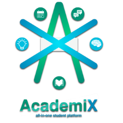
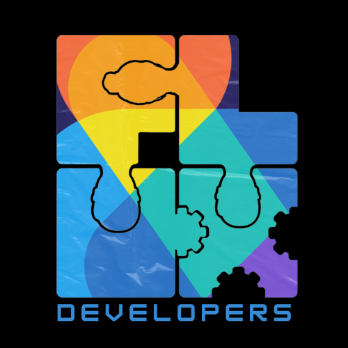

# Introduction

 

AcademiX – an all-in-one student platform designed to supercharge learning. AcademiX combines powerful organization tools for managing homework and deadlines with a vibrant social hub for finding study groups and collaborating with classmates. Our platform also features gamified flashcards and quizzes to make studying fun and engaging, and on-demand tutoring to connect students with qualified instructors for personalized online sessions. AcademiX provides everything students need to succeed in one dynamic platform.

#Repository Contents

<ul>
    <li><strong>Assets:</strong> This section contains all the resources utilized within this repository.</li>
    <li><strong>Coursera Certificates:</strong> Here you will find the certifications earned by team members through Coursera courses.</li>
    <li><strong>User Manual:</strong> Comprehensive instructions for navigating and fully utilizing the features of our app prototype are provided in this manual.</li>
    <li><strong>Part 1:</strong> Documents and materials from the initial phase of the project.</li>
    <li><strong>Part 2:</strong> This section includes documents and resources from the second phase of the project.</li>
    <li><strong>Part 3:</strong> Here you will find documents and materials pertaining to the third phase of the project.</li>
    <li><strong>Part 4:</strong> Documents and materials from the final phase, including project completion documentation, are available here.</li>
</ul>

# FLUX Developers

  

We are the Flux Developers, creators of AcademiX! Team Flux emphasizes the concept of three individuals who are interconnected like puzzle pieces, symbolizing unity and teamwork.

<h4 align="center">Members</h4>

Ken Gyrro Acquiat

Zachary Ben Hao

Kathlyn Anne Mejia

